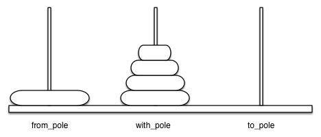

# Tower of Hanoi Solver 

## Author: Hristina Nikolic 
## Date: October, 2024

## Introduction 

This project was done as part of the interview process for the position of the Junior Solutions Engineer at Incode Technologies. 

## History

[The tower of Hanoi](https://en.wikipedia.org/wiki/Tower_of_Hanoi) is a mathematical puzzle. It consists of three rods and several disks of different diameters, which can slide onto any rod. The puzzle starts with the disks stacked on one rod in order of decreasing size, the smallest at the top, thus approximating a canonical shape. The objective of the puzzle is to move the entire stack to the last rod.

 

**Figure 1** Tower of Hanoi Illustration

## Problem Statement

Move all the disks stacked on the first tower over the last tower using a helper tower in the Middle.

## Rules 

There are three simple rules:
1. Only one disk may be moved at a time.
1. Each move consists of taking the upper disk from one of the stacks and placing it on top of another stack or an empty rod.
1. No disk may be placed on top of a disk that is smaller than it.

With 3 disks, the puzzle can be solved in 7 moves. The minimal number of moves required to solve a Tower of Hanoi puzzle is 2<sup>n</sup> − 1, where n is the number of disks.

If you want to better understand the problem, we recommend watching this [video](https://www.youtube.com/watch?v=rf6uf3jNjbo&t=282s). 

## Solution 

We developped an application that solves the Hanoi Towers Puzzle, and has the following characteristics:
- The App must be implemented considering a Back-End service for algorithm/calculations execution, and a Front-End Application that shows the movements required to resolve it based on a specific number of disks.
- The Back-End service should be services/microservices that use JSON payloads.
- The Front-End could be a Web Application that will consume the Back End Service/API and must show the required movements to solve the Puzzle.

## Algorithm

The problem can be solved with a few different algorithms: 
1. Iterative Algorithm - The iterative algorithm for the Tower of Hanoi employs a systematic approach to move disks without recursion, often utilizing a loop and following specific rules based on the parity of the number of disks. It typically involves moving disks between the rods in a predetermined sequence, ensuring that smaller disks are always placed on top of larger disks. This approach also requires 2<sup>n</sup> − 1 moves, providing an efficient way to solve the puzzle without the overhead of recursive function calls.
1. Recursive Algorithm - The recursive algorithm for solving the Tower of Hanoi involves breaking down the problem into smaller subproblems. It recursively moves the top n−1n−1 disks from the source rod to an auxiliary rod, then moves the largest disk directly to the destination rod, and finally moves the n−1n−1 disks from the auxiliary rod to the destination rod. This elegant method utilizes the principle of recursion to achieve the solution in 2<sup>n</sup> − 1 moves.

For this application, we chose to implement both recursive and iterative algorithm.   

## Application Architecture Diagram 

To create an effective application diagram for your Tower of Hanoi project, To visualizing the structure of the application, especially how its main components interact, we created an effective application diagram using [draw.io](https://app.diagrams.net/). 

 

**Figure 2** Application Architecture Diagram.

## Tech Stack

### Back-end 

The back-end will:
- Calculate the sequence of moves required to solve the puzzle based on the number of disks.
- Expose an API endpoint that receives the number of disks and returns the steps in JSON format.

Language: Python 

API: RESTful JSON API

### Front-end

The front-end will:
- Allow the user to input the number of disks.
- Consume the back-end API to retrieve the list of moves.
- Display the steps to solve the puzzle and optionally show the graphical representation of the puzzle.

Language: Python

Framework: Tkinter (Python)

API: RESTful JSON API

## Requrements and Installation 

The application was developed using Python 3. 

If you do not have it installed visit the official [website](https://www.python.org/downloads/) to learn how to do that.

Additionally, the application uses Python's module [Tkinter](https://docs.python.org/3/library/tkinter.html), is the standard Python interface to the Tcl/Tk GUI toolkit.

To learn more about some of the most commonly used widgets, check out this [article](https://www.geeksforgeeks.org/python-gui-tkinter/#color-option-in-tkinter).

First, clone the repository:

```bash 
git clone https://github.com/hristinanikpi/tower_of_hanoi.git
cd tower_of_hanoi
```

Afterwards, use the following command to run the application: 

```bash 
python3 app.py 
```

## Demonstration 

The application for 3 disks runs as follow: 

 

**Figure 3** Tower of Hanoi Solver for 3 disks.

The apllication for 4 disks runs as follow:

 

**Figure 4** Tower of Hanoi Solver for 4 disks. 

## Solving Time

In order to determine how well the application performs, we calculated the average solving time for different numbers of disks rounded to 6 digits.

|  5 disks  | Recursive Algorithm   | Iterative Algorithm   |
|------------|:----------:|-----------:|
| 1. try| 0.001874| Row 1 Col 3|
| 2. try| 0.001886| Row 2 Col 3|
| 3. try| 0.001813| Row 3 Col 3|
| 4. try| 0.001815| Row 3 Col 3|
| 5. try| 0.001800| Row 3 Col 3|
| **average**| 0.0018376| Row 3 Col 3|

**Table 1** Table of solving times for 5 disks for both recursive and iterative algorithms.

|  10 disks  | Recursive Algorithm   | Iterative Algorithm   |
|------------|:----------:|-----------:|
| 1. try| 0.016476| Row 1 Col 3|
| 2. try| 0.017035| Row 2 Col 3|
| 3. try| 0.016347| Row 3 Col 3|
| 4. try| 0.016690| Row 3 Col 3|
| 5. try| 0.016434| Row 3 Col 3|
| **average**| 0.016596| Row 3 Col 3|

**Table 2** Table of solving times for 10 disks for both recursive and iterative algorithms.

|  20 disks  | Recursive Algorithm   | Iterative Algorithm   |
|------------|:----------:|-----------:|
| 1. try| 3.537602| Row 1 Col 3|
| 2. try| 3.583698| Row 2 Col 3|
| 3. try| 3.535073| Row 3 Col 3|
| 4. try| 3.592360| Row 3 Col 3|
| 5. try| 3.502956| Row 3 Col 3|
| **average**| 3.550258| Row 3 Col 3|

**Table 3** Table of solving times for 20 disks for both recursive and iterative algorithms.

|  50 disks  | Recursive Algorithm | Iterative Algorithm |
|------------|:----------:|-----------:|
| 1. try| Row 1 Col 2| Row 1 Col 3|
| 2. try| Row 2 Col 2| Row 2 Col 3|
| 3. try| Row 3 Col 2| Row 3 Col 3|
| 4. try| Row 3 Col 2| Row 3 Col 3|
| 5. try| Row 3 Col 2| Row 3 Col 3|
| **average**| Row 3 Col 2| Row 3 Col 3|

**Table 4** Table of solving times for 50 disks for both recursive and iterative algorithms.

## Future Improvements 

The application work well and has all the ecential elements. However, there is always room for improvement. Some of the extentions that can be done to this work include: 

1. Enhanced Visuals: Improve the design and add animations or 3D graphics for a more immersive experience.
1. Web and Mobile Compatibility: Develop a web application as well as its mobile-responsive version for broader accessibility.
1. Alternative Algorithms: Showcase different methods or optimization techniques such as Q-learning.
1. Statistics Tracking: Track user performance metrics, such as moves taken and time spent.
1. Difficulty Levels: Offer varied levels to cater to beginners and advanced users.

## Conclusion

The Tower of Hanoi application offers users an interactive way to engage with one of the classic algorithmic puzzles, enhancing understanding of recursion, logic, and algorithmic thinking. With its visual approach, this tool serves as both an educational resource and a fun exercise in problem-solving, encouraging users to explore the mechanics of the puzzle in a hands-on manner.